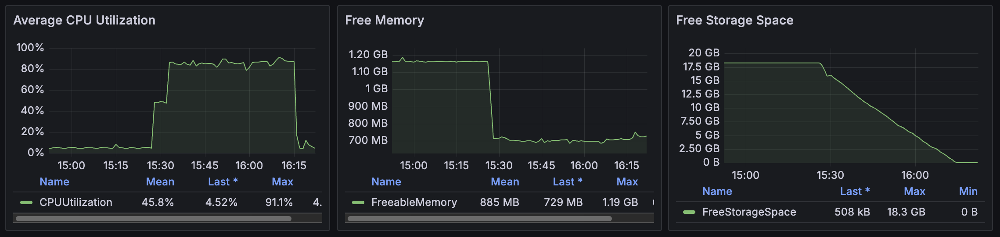

## 테스트 데이터 주입
### RDS 스토리지 증설
부하테스트용 더미데이터를 넣는 과정에서 RDS의 여유 용량 18.3G가 전부 소모되어버려서 테스트 데이터 주입 서비스가 중단됨.

주입 과정에서 용량이 부족해질 것임을 에측하고, RDS 용량 증설은 설정값만 바꾸면 재시작 없이 바로 적용되기 때문에 RDS 스토리지를 테라폼으로 50G로 올려서 apply했으나, 즉시 반영되지 않음.

원인을 파악하던 중 결국 용량이 다 차서 PostgreSQL이 read-only 모드로 전환됨.
이후 알아낸 원인은 apply_immediately=true여야 즉시 반영이 되는데 기본값이 false여서 maintenance window가 되어서야 반영이 되는 상황이었음.

웹 콘솔에 들어가서 직접 즉시 50G 증설 적용하여 해결.

추신: 스토리지 오토스케일링 설정하여 다 차기 전에 알아서 증설되게 하는 방법도 있었음.

+ 용량의 주범은 음식점 데이터. 음식점 레코드 하나가 postgis 인덱스?까지 갖기 때문에 2~4KB를 차지.
postgit 좌표 자릿수를 줄임으로써 용량 줄이려고 시도 예정.
그리고 데이터 수도 줄여보기로 함.

### 테스트 데이터 주입 속도가 너무 느린 문제

테스트 데이터 주입이 한 시간이 지나도 끝나지 않음. 너무 느림.

확인해보니 CPU 사용률이 80~90%에서 유지되고 있었음.
CPU 스로틀링(적절한 표현인지 모르겠지만)이 병목이 되어 속도를 늦추는 것으로 추정됨.

### 채팅 관련 스레드 폭주
dev 서버 대상으로 팀원이 부하테스트를 걸었는데 스프링이 조재하는 모든 채팅방에 레디스 스트림 구독 스레드를 만드려 해서 스프링이 시작되지 못하는 문제 식별