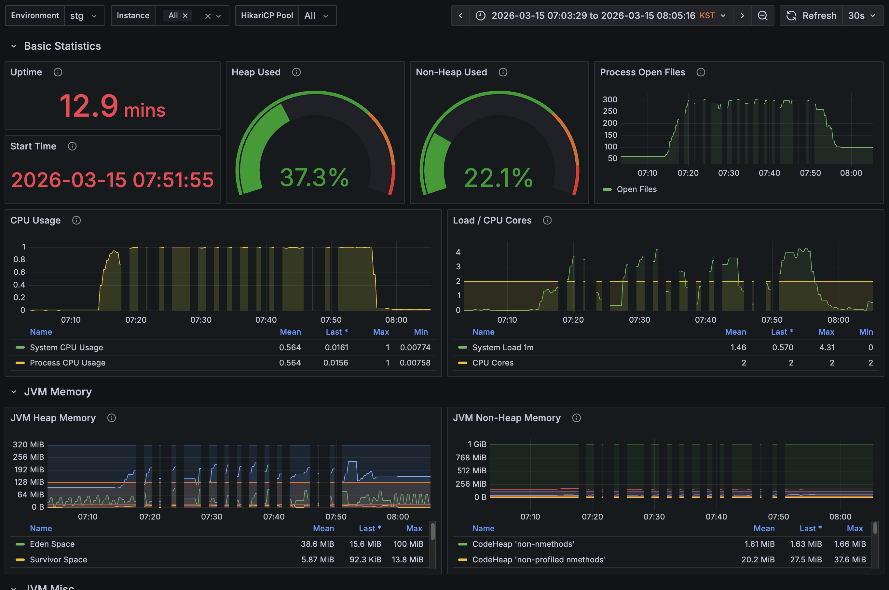
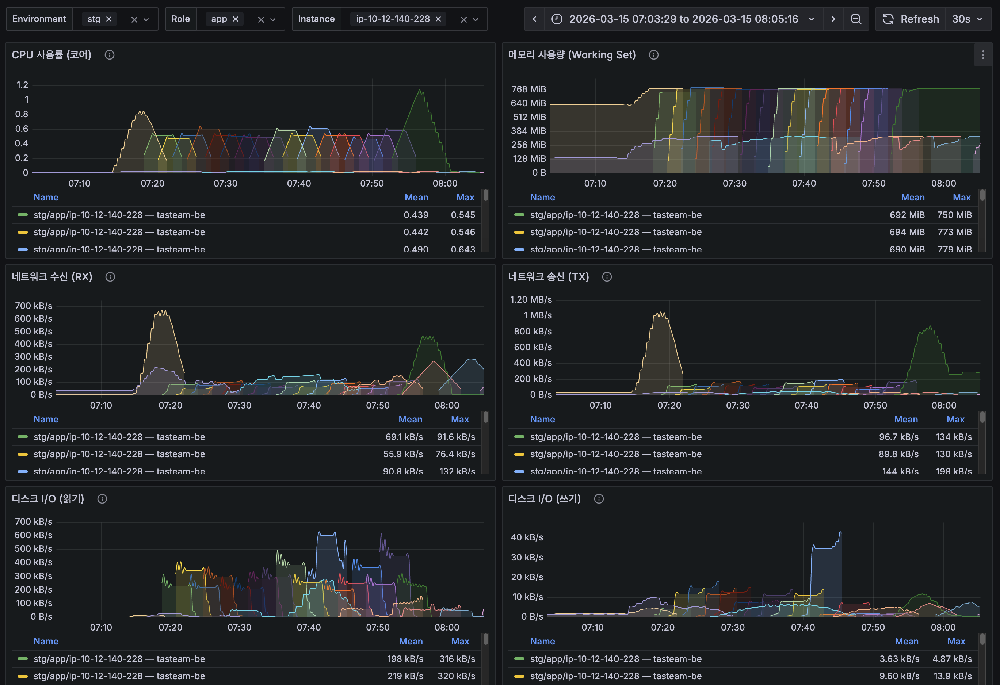
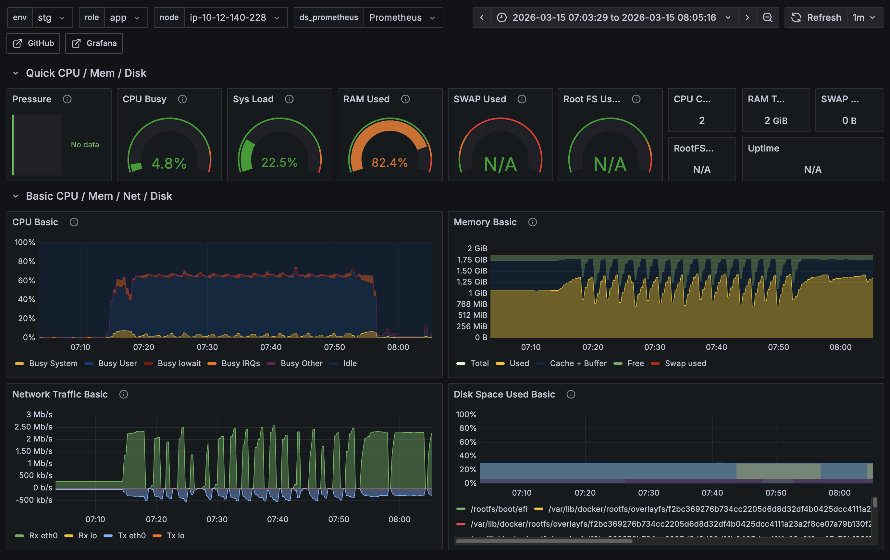

# 부하테스트 시 메트릭 끊겨서 수집되는 문제

- 날짜: 2026-03-14
- 환경: stg / t3.small (2GB RAM)
- 대상: ip-10-12-140-228

## 1. 현상



- 부하테스트 시 스프링부트 메트릭(CPU, Memory, JVM 등)이 끊겨서 수집됨



- 같은 시간대에 컨테이너 메트릭이 무지개 패턴(여러 시계열)으로 표시됨
- 무지개 = 컨테이너가 반복적으로 재생성되며 매번 새 컨테이너 ID가 부여된 것



## 2. 원인 추적

### 2-1. dmesg로 OOM Kill 확인

`sudo dmesg | grep -i "oom\|killed process"` 결과:

- **java(tasteam-be) OOM Kill ~15회** — 약 120~130초 간격으로 반복
  ```
  Memory cgroup out of memory: Killed process 12644 (java)
  total-vm:3415360kB, anon-rss:812928kB, file-rss:13140kB  → RSS ~826MB
  ```
- **alloy OOM Kill ~14회** — 부하테스트 후반부에는 alloy 단독으로도 반복
  ```
  Memory cgroup out of memory: Killed process 12880 (alloy)
  total-vm:2807912kB, anon-rss:347392kB, file-rss:68352kB  → RSS ~413MB
  ```
- `C2 CompilerThre`(JIT 컴파일러)가 OOM 트리거한 경우도 다수

> 참고: `docker inspect`의 `OOMKilled: false`는 `restart: unless-stopped`로 재시작 시 리셋되므로 신뢰 불가. dmesg가 정확한 증거.

### 2-2. 수동 배포 vs CodeDeploy 배포 실험

docker-compose의 mem_limit 기본값과 CodeDeploy(deploy.sh) 계산값이 다름을 발견:

| 컨테이너 | compose 기본값 (수동 배포) | deploy.sh 계산값 (CodeDeploy) |
|----------|--------------------------|------------------------------|
| 백엔드 | 1024m | **~827m** |
| Alloy | 512m | **~355m** |

- 수동 배포 (1024m / 512m) → **OOM 미발생**
- CodeDeploy 배포 (~827m / ~355m) → **OOM 재현**

→ deploy.sh의 메모리 계산이 너무 빡빡하게 할당하는 것이 원인

### 2-3. deploy.sh 메모리 계산 로직 분석

`set_runtime_resource_limits()` 함수의 계산 흐름 (t3.small, 총 ~1910MB):

```
총 메모리 1910MB
  - 호스트 예약: max(1910 * 25%, 768) = 768MB  ← 전체의 40%, 과도함
  - 컨테이너 예산: 1910 - 768 = 1142MB
    - 백엔드 70%: ~800MB
    - Alloy 30%: ~342MB
```

### 2-4. JVM NMT(Native Memory Tracking)로 실측

`-XX:NativeMemoryTracking=summary` 적용 후 `jcmd <pid> VM.native_memory summary` 측정:

| 상태 | Heap | Non-Heap | 합계 (committed) |
|------|------|----------|-----------------|
| 유휴 | ~236MB | ~395MB | **~631MB** |
| 부하 피크 | ~381MB | ~403MB | **~784MB** (max ~794MB) |

Non-Heap 내역 (부하 피크):
- Metaspace ~149MB, CodeCache ~90MB, Symbol ~56MB, Thread ~7MB, Arena ~17MB, NMT overhead ~10MB, 기타 ~66MB

### 2-5. Alloy 메모리 사용량

| 상태 | 사용량 | 비고 |
|------|--------|------|
| 기동 직후 | ~152MB | — |
| 유휴 (안정화 후) | ~291MB | 한도 355MB의 82% |
| 부하 시 | 250MB+ (13분 관측) | ~7-8 MB/min 성장, Go 자체 메모리 제한 없음 |

### 2-6. 호스트 시스템 메모리 실측

`ps`, `/proc/meminfo` 기반 실측:

| 항목 | 사용량 |
|------|--------|
| 프로세스 (dockerd, containerd, SSM agent 등) | ~358MB |
| 커널 (Slab, PageTables, KernelStack, Vmalloc) | ~166MB |
| **호스트 합계** | **~524MB** |

→ 768MB 예약은 ~244MB 과잉

## 3. 근본 원인

**인스턴스 스펙(t3.small, ~1910MB) 대비 워크로드가 빡빡함:**

```
필요 메모리:
  JVM Non-Heap:  ~400MB (줄일 여지 거의 없음)
  JVM Heap 피크: ~381MB (이미 적은 편)
  Alloy 유휴:    ~291MB (Go 런타임 기본 비용)
  호스트 시스템:  ~524MB
  ─────────────────
  합계:          ~1596MB / 1910MB (여유 ~314MB)
```

deploy.sh의 호스트 예약 최솟값(768MB)이 과도하여 컨테이너에 할당되는 양이 부족했고,
부하 시 Heap 성장 + Alloy 성장 + 커널 버퍼 증가로 OOM Kill 발생.

## 4. 조치 이력

### 4-1. 호스트 예약 축소 (효과 부족)

| 조치 | 내용 | PR |
|------|------|----|
| 호스트 예약 최솟값 축소 | 768MB → 600MB | [#623](https://github.com/100-hours-a-week/3-team-Tasteam-be/pull/623) |

적용 후 메모리 한도:

| 컨테이너 | 변경 전 | 변경 후 |
|----------|--------|--------|
| 백엔드 | ~827m | 917m |
| Alloy | ~355m | 393m |

→ **OOM 여전히 발생**. 동적 계산 자체가 t3.small에서 구조적으로 빡빡함.

### 4-2. 메모리 동적 계산 비활성화 (해결)

| 조치 | 내용 | PR |
|------|------|----|
| deploy.sh 메모리 계산 주석처리 | compose 기본값(1024m/512m)에 위임 | [#637](https://github.com/100-hours-a-week/3-team-Tasteam-be/pull/637) |

적용 후 메모리 한도:

| 컨테이너 | 변경 전 | 변경 후 |
|----------|--------|--------|
| 백엔드 | 917m | **1024m** |
| Alloy | 393m | **512m** |

→ **부하테스트 시 OOM 미발생, 메트릭 끊김/무지개 패턴 해소 확인**

## 5. 결론

- **직접 원인**: deploy.sh의 `set_runtime_resource_limits()`가 호스트 예약을 과도하게 잡아 컨테이너 메모리 한도가 빡빡하게 설정됨
- **근본 원인**: t3.small(~1910MB)에서 JVM Non-Heap ~400MB + Heap + Alloy + 호스트 시스템을 모두 수용하기에 스펙이 부족
- **해결**: 메모리 동적 계산을 비활성화하고 compose 기본값(1024m/512m)에 위임
- **향후 고려**: 인스턴스 스펙 업(t3.medium, 4GB) 시 동적 계산 로직 재활성화 가능
