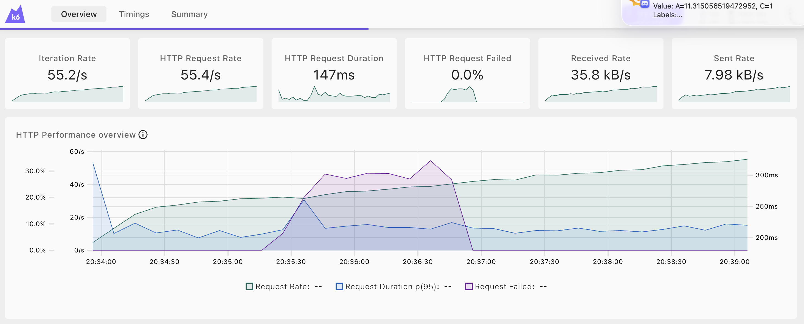
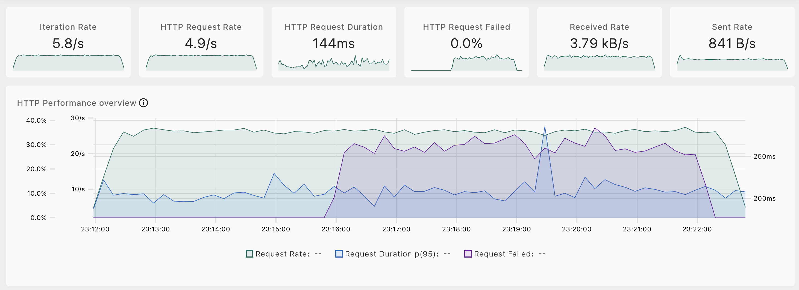

2026년 3월 13일 (금) 무중단 컷오버 실험 후 에러율 0%로 컷오버되고 데이터 정합성 일치하는 것 확인.

그러나 익일 3월 14일 (토) 시퀀스 갭을 100000으로 설정한 것은 필요 이상으로 과한 것 같아 1000으로 다시 내려 실험해보려 함.
그런데 이번에는 컷오버 중에 에러율이 30%까지 치솟는 것을 발견

해결: "Logical Replication 워커 크래시 — PK 충돌 무한 루프" 트러블슈팅 로그 참고