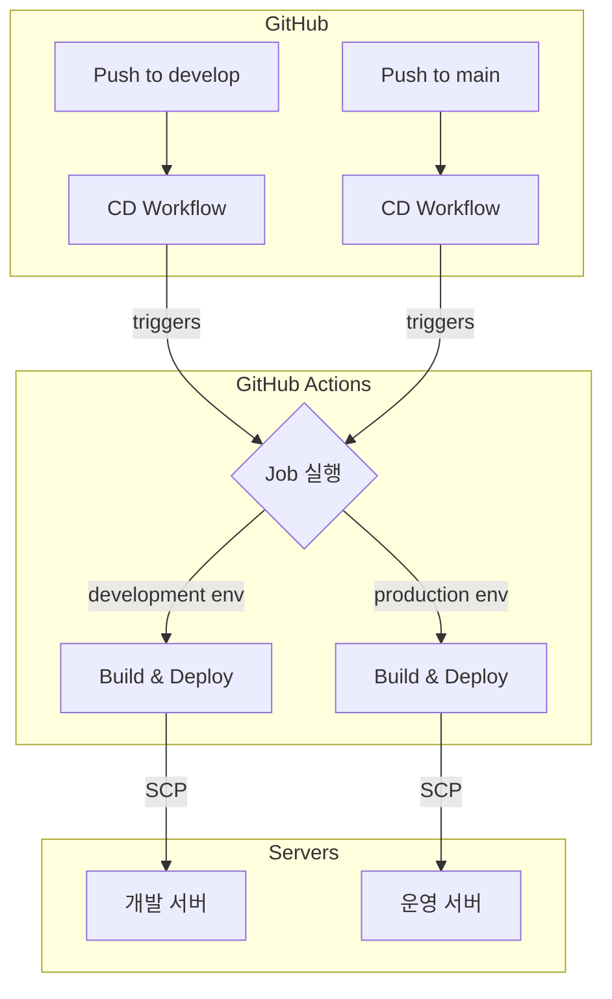

# CD (Continuous Deployment) 가이드

| 항목 | 내용                                                                   |
|---|----------------------------------------------------------------------|
| 문서 목적 | 3개 서비스(Backend, Frontend, AI)의 CD(지속적 배포) 파이프라인 구조와 배포 전략, 정책을 설명한다. |
| 작성 및 관리 | CloudTeam                                                            |
| 최종 수정일 | 2026.01.22                                                           |
| CI 가이드 | [CI (Continuous Integration) 가이드](../CI/README.md)                   |

---

## 목차

- [1. CD 파이프라인 개요](#1-cd-파이프라인-개요)
- [2. 배포 방식: SCP 채택 배경](#2-배포-방식-scp-채택-배경)
- [3. 서비스별 배포 전략](#3-서비스별-배포-전략)
- [4. 환경 및 Secrets 관리](#4-환경-및-secrets-관리)

---

## 1. CD 파이프라인 개요

### 1.1 핵심 원칙

- **Push-to-Deploy**: `develop` 또는 `main` 브랜치에 `push`(merge)가 발생하면 자동으로 배포 워크플로우가 실행됩니다.
- **GitHub Actions 중심**: 모든 배포는 GitHub Actions를 통해서만 실행되며, 서버에 직접 접속하여 배포하는 행위는 금지됩니다.
- **환경 분리**: `develop` 브랜치는 **개발(Development) 서버**로, `main` 브랜치는 **운영(Production) 서버**로 배포됩니다.

### 1.2 전체 아키텍처

### 1.3 서비스별 CD 워크플로우

| 서비스 | 워크플로우 파일 | 트리거 | 특징 |
|---|---|---|---|
| **Backend** | `ci-cd-full.yml` | `develop`, `main` push | CI/CD 통합 워크플로우 내에서 배포 Job 실행 |
| **Frontend** | `cd.yml` | `develop`, `main` push | GitHub Environments 기반 환경별 배포 |
| **AI** | `cd.yml` | `develop`, `main` push | GitHub Environments 기반 환경별 배포 |

---

## 2. 배포 방식: SCP

| 구분 | Git Pull 방식 | SCP 방식 (채택) |
|---|---|---|
| **실행 주체** | 배포 서버 | GitHub Actions Runner |
| **서버 권한** | GitHub 저장소 접근 권한 **필요** | GitHub 저장소 접근 권한 **불필요** |
| **프로세스** | 분산적 (서버마다 실행) | 중앙집중적 (Actions에서 통제) |

### SCP 방식 선택 이유

1.  **보안 강화 (가장 중요)**
    - 서버에 GitHub 접근용 SSH 키나 토큰을 보관할 필요가 없습니다.
    - 이는 **최소 권한 원칙**을 준수하며, 배포 서버가 침해되더라도 코드 저장소의 안전을 보장합니다.

2.  **중앙 통제 및 추적성**
    - 모든 배포는 GitHub Actions 워크플로우를 통해서만 실행되므로, 모든 배포 기록(성공, 실패, 실행자, 커밋)이 로그로 남습니다.
    - 배포 프로세스가 중앙에서 관리되어 통제 및 감사 추적이 용이합니다.

3.  **저장소 설정과 무관**
    - 향후 GitHub 저장소가 `Private`으로 전환되더라도 배포 방식의 변경이 전혀 필요 없습니다.

---

## 3. 서비스별 배포 전략

모든 서비스는 SCP를 통해 서버의 임시 디렉토리(`~/SERVICE/temp`)로 파일을 전송한 후, 각 서비스에 맞는 배포 스크립트를 실행하는 2단계 배포 방식을 사용합니다.

### 3.1 Backend: 중단 배포 (Stop-and-Start)

- **배포 방식**: 기존 서버 중지 후 새 버전 시작 (다운타임 발생)
- **배포 스크립트**: [`scripts/backend/stop-and-start.sh`](../scripts/backend/stop-and-start.sh)
- **프로세스**:
    1.  `ci-cd-full.yml`의 `deploy` Job이 실행됩니다.
    2.  새로운 JAR 파일을 서버의 임시 폴더로 전송합니다.
    3.  `stop-and-start.sh` 스크립트가 실행됩니다:
        - 기존 프로세스를 종료합니다. (Graceful Shutdown)
        - 새 JAR 파일을 실행합니다. (고정 포트 8080 사용)
        - Health Check를 통해 정상 시작을 확인합니다.
    4.  배포 완료 후 이전 버전의 JAR/로그는 최신 5개만 유지됩니다.

**특징**:
- 배포 중 짧은 다운타임(약 30초~1분)이 발생합니다.
- 단순한 구조로 운영이 쉽고 안정적입니다.
- 롤백 시 이전 JAR 파일을 다시 실행하면 됩니다.

### 3.2 Frontend & AI: 임시 디렉토리를 이용한 안전한 파일 교체

- **배포 방식**: 임시 디렉토리(temp)를 활용한 2단계 파일 교체
- **프로세스**:
    1.  `cd.yml`의 `deploy` Job이 실행됩니다.
    2.  빌드된 산출물(FE: 정적 파일, AI: 소스코드)을 서버의 임시 폴더(`~/frontend/temp` 또는 `~/ai/temp`)로 전송합니다.
    3.  전송이 **완전히 성공**하면, SSH 명령을 통해 실제 서비스 디렉토리의 내용을 삭제하고 임시 폴더의 내용으로 교체합니다.
    4.  이 방식은 파일 전송 중 오류가 발생해도 기존 서비스에 영향을 주지 않는 장점이 있습니다.

---

## 4. 환경 및 Secrets 관리

### 4.1 Frontend & AI: GitHub Environments 활용

Frontend와 AI는 `GitHub Environments`를 통해 `develop`과 `main` 환경을 분리합니다.

- **설정 위치**: `Repository > Settings > Environments`
- **환경 매핑**:
    - `develop` 브랜치 → `development` 환경
    - `main` 브랜치 → `production` 환경
- **Secrets**: 각 환경에 `HOST`, `USERNAME`, `KEY`, `PORT` 등 서버 접속 정보를 **Environment secrets**로 설정합니다. 워크플로우는 배포 시점에 맞는 환경의 Secret을 자동으로 사용합니다.

### 4.2 Backend: Repository Secrets 활용

Backend는 CI/CD 통합 워크플로우의 구조적 특성상 Repository Secrets를 직접 사용합니다.

- **설정 위치**: `Repository > Settings > Secrets and variables > Actions`
- **Secrets**: `DEVELOP_HOST`, `PROD_HOST` 와 같이 Secret 이름에 환경을 명시하여 구분합니다.

### 4.3 공통 Secret

- `DISCORD_WEBHOOK_URL`: 모든 워크플로우에서 공통으로 사용하는 Discord 알림용 Secret이며, **Repository secrets**에 설정합니다.
