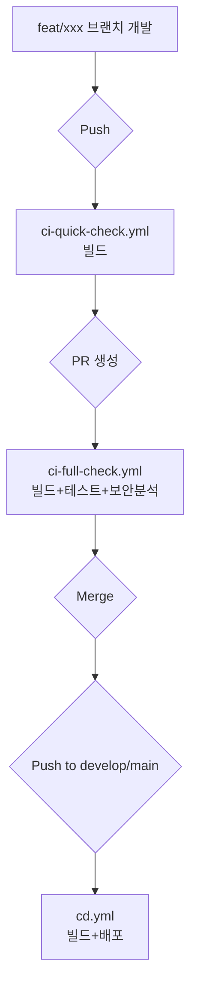

# CI 파이프라인 최종 가이드

| 항목 | 내용 |
|---|---|
| 문서 목적 | CI/CD 파이프라인의 최종 구조와 각 워크플로우의 역할을 설명한다 |
| 작성 및 관리 | CloudTeam |
| 최종 수정일 | 2026.01.26 |
| 원본 설계 문서 | [CI 파이프라인 설계](./ci-설계.md) |

---

## 목차

- [1. 설계 원칙](#1-설계-원칙)
- [2. 파이프라인 개요](#2-파이프라인-개요)
- [3. 워크플로우 상세](#3-워크플로우-상세)
- [4. 서비스별 구성](#4-서비스별-구성)
- [5. 전제 조건](#5-전제-조건)
- [6. MVP 기간 생략 항목](#6-mvp-기간-생략-항목)
- [7. 알림 시스템](#7-알림-시스템)
- [8. Secrets 관리](#8-secrets-관리)

---

## 1. 설계 원칙

| 원칙 | 설명 |
|---|---|
| **PR 검증 집중** | 모든 품질 검증(테스트, 보안분석)은 PR 단계에서 완료한다. |
| **Push는 배포 전용** | merge 후 push는 이미 검증된 코드이므로 빌드 + 배포만 수행한다. |
| **빠른 피드백** | Feature 브랜치는 빌드만으로 빠른 피드백을 제공한다. |
| **3개 서비스 동일 정책** | Backend, Frontend, AI 모두 동일한 기준을 적용하는 것을 목표로 한다. |

### 브랜치별 검증 수준

| 이벤트 | 빌드 | 테스트 | 보안분석 | 배포 |
|---|:---:|:---:|:---:|:---:|
| `feat/**`, `hotfix/**` push | O (-x test) | X | X | X |
| PR → `develop`, `main` | O | O | O | X |
| `develop` push | O (-x test) | X | X | O (개발서버) |
| `main` push | O (-x test) | X | X | O (운영서버) |

---

## 2. 파이프라인 개요

### 2.1 표준 파이프라인 구조 (AI, Frontend)

AI와 Frontend는 설계 원칙에 따라 CI와 CD 워크플로우를 명확히 분리합니다.

| 파일명 | 트리거 | 역할 |
|---|---|---|
| `ci-quick-check.yml` | `feat/**`, `hotfix/**` push | 빠른 빌드 검증 |
| `ci-full-check.yml` | PR → `develop`, `main` | 테스트 + 보안분석 |
| `cd.yml` | `develop`, `main` push | 환경별 배포 (GitHub Environments) |



### 2.2 예외 구조 (Backend)

Backend는 빌드된 **JAR artifact를 Job 간에 효율적으로 공유**하기 위해 CI와 CD를 `ci-cd-full.yml`이라는 단일 워크플로우로 통합했습니다. 이는 설계상 예외 케이스에 해당합니다.

| 파일명 | 트리거 | 역할 |
|---|---|---|
| `ci-quick-check.yml` | `feat/**`, `hotfix/**` push | 빠른 빌드 검증 |
| `ci-cd-full.yml` | PR + `develop`/`main` push | CI+CD 통합 |

```mermaid
graph TD
    A[feat/xxx 브랜치 개발] --> B{Push};
    B --> C[ci-quick-check.yml<br>빌드];
    C --> D{PR 생성};
    D --> E[ci-cd-full.yml (security-scan job)<br>테스트+보안분석];
    E --> F{Merge};
    F --> G{Push to develop/main};
    G --> H[ci-cd-full.yml (build & deploy jobs)<br>빌드+배포];
```

---

## 3. 워크플로우 상세

### 3.1 `ci-quick-check.yml` (공통)

- **역할**: `feat` 또는 `hotfix` 브랜치 push 시, 빠른 빌드 검사를 통해 코드의 통합 가능성을 최소한으로 검증합니다.
- **트리거**: `feat/**`, `hotfix/**` 브랜치 `push`
- **주요 단계**:
    1. 소스코드 체크아웃
    2. 각 서비스 런타임 설정 (JDK, Node.js, Python)
    3. **빌드만 실행** (테스트는 제외하여 속도 확보)
    4. 실패 시에만 Discord 알림

### 3.2 `ci-full-check.yml` (AI, Frontend)

- **역할**: `develop` 또는 `main` 브랜치로의 PR 생성 시, 코드 품질을 종합적으로 검증합니다.
- **트리거**: `develop`, `main` 브랜치 대상 `pull_request`
- **주요 단계**:
    1. 소스코드 체크아웃
    2. 런타임 설정 및 의존성 설치
    3. Lint, 포맷팅 검사 (해당 시)
    4. 빌드 및 단위 테스트 실행
    5. 보안 분석 (해당 시)
    6. 실패 시에만 Discord 알림

### 3.3 `cd.yml` (AI, Frontend)

- **역할**: `develop` 또는 `main` 브랜치에 코드가 병합(push)되면, 각 환경에 자동으로 배포합니다.
- **트리거**: `develop`, `main` 브랜치 `push`
- **주요 특징**:
    - **GitHub Environments**: `main` 브랜치는 `production` 환경, `develop` 브랜치는 `development` 환경으로 자동 매핑됩니다.
    - **환경별 Secrets**: 배포에 필요한 `HOST`, `KEY` 등의 정보는 GitHub Environments에 설정된 Secret을 사용합니다.
    - **배포 단계**: 빌드 → SCP/SSH를 통한 서버 전송 → 배포 스크립트 실행
    - 성공/실패 시 항상 Discord 알림

### 3.4 `ci-cd-full.yml` (Backend)

- **역할**: Backend의 CI와 CD를 모두 처리하는 통합 워크플로우입니다.
- **트리거**: `develop`, `main` 브랜치 대상 `pull_request` 및 `push`
- **주요 Job**:
    - `security-scan` (PR 시 실행): `CodeQL`, `SpotBugs`를 이용한 테스트 및 정적 보안 분석
    - `build-and-deploy` (Push 시 실행): 테스트를 제외하고 JAR 파일을 빌드하여 `artifact`로 저장
    - `deploy` (Push 시 실행): `build-and-deploy` Job 완료 후, `artifact`를 내려받아 서버에 배포

---

## 4. 서비스별 구성

### 4.1 런타임 및 빌드 도구

| 항목 | Backend | Frontend | AI |
|---|---|---|---|
| 런타임 | JDK 21 (temurin) | Node.js 22 | Python 3.11 |
| 빌드 도구 | Gradle | npm | pip |

### 4.2 검증 단계별 명령어

| 워크플로우 | Backend | Frontend | AI |
|---|---|---|---|
| **Quick Check** | `./gradlew build -x test` | `npm run build` | `python -m py_compile app.py` |
| **Full Check** | `./gradlew test` | `npm run lint && npm run build` | `python -m py_compile app.py` |

---

## 5. 전제 조건

### 5.1 Branch Protection Rule

`develop`, `main` 브랜치에는 아래 규칙을 적용하여 코드 품질과 안정성을 유지합니다.
- **Require a pull request before merging**: 직접적인 push를 금지하고 PR을 통한 변경만 허용합니다.
- **Require status checks to pass before merging**: `ci-full-check` 또는 `security-scan` Job이 성공해야만 Merge가 가능합니다.
- **Require approvals**: 최소 1명 이상의 리뷰어 승인을 필수로 합니다.

### 5.2 GitHub Environments

AI, Frontend의 자동 배포를 위해 아래 두 환경을 사용합니다.
- **Settings > Environments**에서 `production`과 `development` 환경을 생성해야 합니다.
- 각 환경에 배포 대상 서버 정보를 `Environment secrets`로 설정해야 합니다.

---

## 6. MVP 기간 생략 항목

빠른 개발 속도 확보를 위해 MVP 기간 동안 아래 항목은 비활성화 상태입니다.

| 서비스 | 생략 항목 | 비고 |
|---|---|---|
| **Backend** | Checkstyle, Spotless | 코드 스타일 및 포맷팅 검사 |
| **Frontend** | `npm test` | 단위 테스트 |
| **AI** | Lint, 테스트, 보안분석 | 전체적인 품질 검증 |

---

## 7. 알림 시스템

Discord Webhook을 통해 CI/CD 파이프라인의 주요 상태 변경을 알립니다.

| 이벤트 | 대상 브랜치 | 성공 알림 | 실패 알림 | 담당 워크플로우 |
|---|---|:---:|:---:|---|
| `push` | `feat/**`, `hotfix/**` | X | O | `ci-quick-check.yml` |
| `pull_request` | `develop`, `main` | X | O | `ci-full-check.yml` |
| `push` (merge) | `develop`, `main` | O | O | `cd.yml` |

---

## 8. Secrets 관리

### 8.1 AI, Frontend (GitHub Environments)

- **설정 위치**: Repository > Settings > Environments > ( 각 환경 선택 )
- **Secrets**: `HOST`, `USERNAME`, `KEY`, `PORT` 등 배포에 필요한 정보를 각 환경(`production`, `development`)에 맞게 설정합니다.

### 8.2 Backend (Repository Secrets)

- **설정 위치**: Repository > Settings > Secrets and variables > Actions
- **Secrets**: `DEVELOP_HOST`, `DEVELOP_USERNAME` 등 특정 환경을 명시한 이름의 Secret을 사용합니다.

### 8.3 공통 (Repository Secrets)

- `DISCORD_WEBHOOK_URL`: 모든 워크플로우에서 공통으로 사용하는 Discord 알림용 Webhook URL입니다.