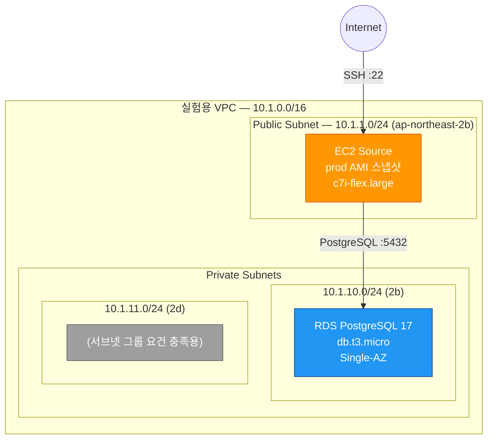
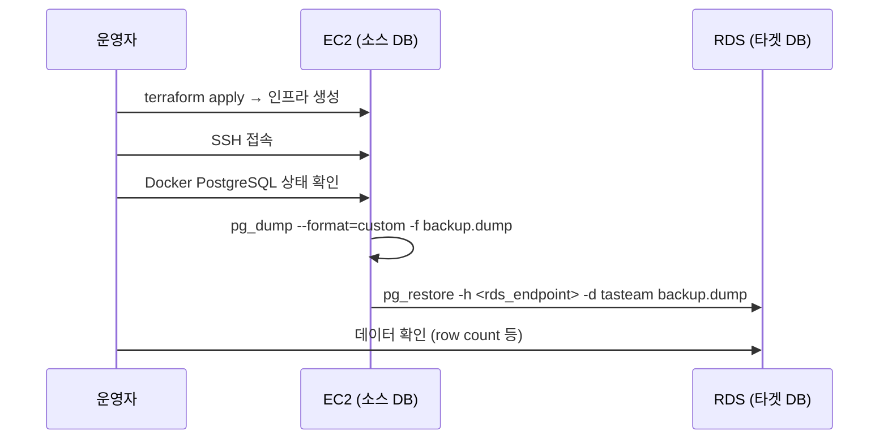
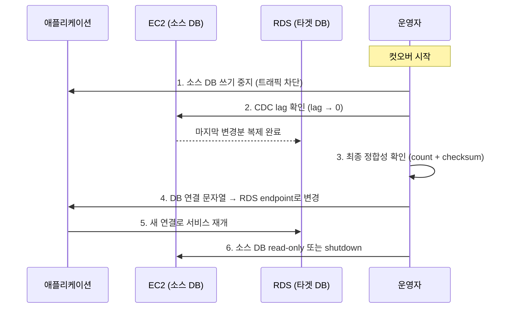

# PostgreSQL 마이그레이션 실험 계획서

> **프로젝트**: Tasteam  
> **작성일**: 2026-02-12  
> **목적**: EC2 Docker PostgreSQL → RDS PostgreSQL 무중단 마이그레이션 검증

---

## 1. 배경 및 목표

### 1.1 현재 상태 (v1)

| 항목 | 상세 |
|------|------|
| **인프라** | EC2 단일 인스턴스 (c7i-flex.large) |
| **VPC** | `172.31.0.0/16` (ap-northeast-2b) |
| **데이터베이스** | PostgreSQL — Docker 컨테이너로 구동 |
| **스토리지** | EBS gp3 30GB |
| **기타 서비스** | Redis (Docker), Backend, Frontend, AI 서비스 — 모두 동일 EC2 |

### 1.2 마이그레이션 목표 (v2)

- EC2 내 Docker PostgreSQL → **AWS RDS PostgreSQL**로 분리
- **무중단(Zero-Downtime) 컷오버** 전략 검증
- 데이터 정합성 확인 방법론 수립
- Redis는 이번 마이그레이션 대상 **아님** (별도 처리 예정)

### 1.3 실험의 필요성

프로덕션 환경에 직접 변경을 가하기 전에, **격리된 실험 환경**에서 다음을 검증한다:

1. pg_dump/pg_restore 기반 초기 데이터 이전 프로세스
2. CDC(Change Data Capture) 기반 실시간 복제 가능 여부
3. 컷오버 시점의 데이터 정합성 보장 방법
4. 예상 다운타임 및 롤백 절차

---

## 2. 실험 구조 (단계별)

```
v1-v2-migration/
└── experiments/
    ├── 01-single-vpc-rds         ← 현재 진행 중
    ├── 02-cross-account-vpc-peering   (추후)
    ├── 03-dms-migration               (추후)
    └── 04-logical-replication         (추후)
```

| 실험 | 목적 | 상태 |
|------|------|------|
| **01-single-vpc-rds** | 단일 VPC 내 EC2→RDS 마이그레이션 기본 검증 | 🔧 Terraform 코드 작성 완료 |
| **02-cross-account-vpc-peering** | 크로스 계정 VPC 피어링 환경에서의 마이그레이션 검증 | 📋 계획 |
| **03-dms-migration** | AWS DMS를 활용한 CDC 마이그레이션 검증 | 📋 계획 |
| **04-logical-replication** | PostgreSQL 네이티브 Logical Replication 검증 | 📋 계획 |

---

## 3. 실험 01: Single VPC + RDS

### 3.1 아키텍처



### 3.2 인프라 구성 요소

| 리소스 | 설정 | 용도 |
|--------|------|------|
| **VPC** | `10.1.0.0/16` | v1 VPC(172.31.x)와 CIDR 충돌 방지 |
| **Public Subnet** | `10.1.1.0/24` (2b) | EC2(소스) 배치, IGW 연결 |
| **Private Subnet A** | `10.1.10.0/24` (2b) | RDS 배치 |
| **Private Subnet B** | `10.1.11.0/24` (2d) | RDS 서브넷 그룹 최소 2 AZ 요건 |
| **EC2** | prod AMI 사용 | PostgreSQL + 데이터 포함된 상태로 기동 |
| **RDS** | PostgreSQL 17, db.t3.micro, gp3 20GB | 마이그레이션 타겟 |
| **보안 그룹** | EC2: SSH(22) 허용 / RDS: EC2에서 5432만 허용 | 최소 권한 원칙 |

### 3.3 Terraform 파일 구성

| 파일 | 내용 |
|------|------|
| `versions.tf` | Terraform 1.14+, AWS provider, S3 backend |
| `variables.tf` | `source_ami`(필수), `db_password`(필수), 인스턴스 타입, DB 설정 등 |
| `vpc.tf` | VPC, 서브넷 3개, IGW, 라우팅 |
| `ec2.tf` | 소스 EC2 (prod AMI), EIP |
| `rds.tf` | 타겟 RDS, 서브넷 그룹, 파라미터 그룹(`rds.logical_replication=1`) |
| `security.tf` | EC2 SG, RDS SG |
| `outputs.tf` | IP, endpoint, SSH/psql 접속 명령어 |
| `terraform.tfvars.example` | 변수 예시 파일 |

### 3.4 주요 설계 결정

| 항목 | 결정 | 이유 |
|------|------|------|
| **`rds.logical_replication = 1`** | 파라미터 그룹에 사전 설정 | CDC 실험을 인프라 배포 직후 바로 시작할 수 있도록 |
| **S3 backend key 분리** | `v1-v2-migration/01-.../terraform.tfstate` | v1 state와 완전 격리 |
| **NAT Gateway 없음** | private subnet에 미배치 | 비용 절감, RDS는 외부 접속 불필요 |
| **Single-AZ** | `multi_az = false` | 실험용이므로 비용 최적화 |
| **`skip_final_snapshot = true`** | 최종 스냅샷 생략 | 실험 종료 시 빠른 리소스 정리 |

---

## 4. 마이그레이션 실험 시나리오

### Phase 1 — 인프라 프로비저닝 & 초기 데이터 마이그레이션

**목표**: EC2 소스 DB의 전체 데이터를 RDS로 풀 덤프 복원



**세부 절차**:

1. `terraform apply`로 실험 인프라 생성
2. EC2에 SSH 접속 → Docker 내 PostgreSQL 상태 확인
3. **풀 덤프**: `pg_dump --format=custom --no-owner --no-acl -f /tmp/backup.dump`
4. **복원**: `pg_restore -h <rds_endpoint> -U postgres -d tasteam --no-owner /tmp/backup.dump`
5. 기본 데이터 확인 (테이블 목록, row count)

**예상 소요 시간**: 데이터 크기에 따라 다름 (소규모 실험 데이터 기준 수 분)

> [!NOTE]
> **Q: 처음부터 Logical Replication으로 전체 데이터를 복제하면 안 되나요? (`copy_data = true`)**
> 
> 가능하지만, **스키마(DDL)와 시퀀스(Sequence)** 때문에 `pg_dump` 과정이 여전히 필요합니다.
> 1. **스키마**: Logical Replication은 테이블 생성(DDL)을 자동 복제하지 않으므로, 타겟에 테이블이 미리 존재해야 합니다. (`pg_dump --schema-only` 필요)
> 2. **시퀀스(SERIAL)**: `id` 자동 증가 값(Sequence)은 복제되지 않습니다. 컷오버 시점에 수동으로 동기화하지 않으면 PK 충돌이 발생합니다.
> 3. **성능**: 대용량 DB의 경우 병렬 덤프(`pg_restore -j`)가 단일 스레드 초기 복제보다 빠를 수 있습니다.
> 
> 따라서 **[스키마/시퀀스 덤프] + [Logical Replication 데이터 동기화]** 조합이 가장 안정적입니다.

### Phase 2 — CDC (Change Data Capture) 시뮬레이션

**목표**: 풀 덤프 이후 소스에서 발생하는 변경을 실시간으로 RDS에 복제

> [!IMPORTANT]
> 이번 01 실험에서는 **PostgreSQL Logical Replication 기반 CDC**를 기본으로 시도합니다.

#### 사전 요구사항 확인

| 항목 | 소스 (EC2 Docker PG) | 타겟 (RDS) | 비고 |
|------|----------------------|------------|------|
| `wal_level` | `logical` 필요 | 자동 설정 | 소스 Docker PG 설정 변경 필요 |
| `max_replication_slots` | ≥ 1 | 자동 | — |
| `max_wal_senders` | ≥ 1 | 자동 | — |
| `rds.logical_replication` | N/A | `1` (설정 완료) | Terraform 파라미터 그룹에 반영됨 |

#### CDC 설정 절차

```sql
-- [소스 EC2] Publication 생성
CREATE PUBLICATION tasteam_pub FOR ALL TABLES;

-- [타겟 RDS] Subscription 생성
CREATE SUBSCRIPTION tasteam_sub
    CONNECTION 'host=<ec2_private_ip> port=5432 dbname=tasteam user=postgres password=...'
    PUBLICATION tasteam_pub;
```

#### CDC 검증

- 소스에 테스트 데이터 INSERT → 타겟에서 즉시 조회 가능한지 확인
- UPDATE/DELETE도 정상 복제되는지 확인
- 복제 지연(lag) 모니터링: `pg_stat_replication` 뷰 조회

### Phase 3 — 데이터 정합성 확인

**목표**: 소스와 타겟 간 데이터가 일치하는지 다각도로 검증

| 방법 | 명령어/쿼리 | 적합한 상황 |
|------|-------------|-------------|
| **Row count 비교** | `SELECT count(*) FROM <table>` 양쪽 비교 | 기본, 빠름 |
| **Checksum 비교** | `SELECT md5(string_agg(t::text, '' ORDER BY id)) FROM <table> t` | 테이블 단위 정밀 비교 |
| **시퀀스 값 비교** | `SELECT last_value FROM <sequence>` 양쪽 비교 | CDC lag 확인 |
| **랜덤 샘플링** | 랜덤 PK 추출 → 양쪽 row 비교 | 대용량 테이블 |
| **pgcompare / data-diff** | 오픈소스 도구 활용 | row-level diff 필요 시 |

> [!TIP]
> **실용적 접근**: EC2에서 bash 스크립트로 각 테이블별 `count` + `checksum`을 양쪽 비교하는 것을 추천

#### 정합성 확인 스크립트 (예시)

```bash
#!/bin/bash
SOURCE_HOST="localhost"
TARGET_HOST="<rds_endpoint>"
DB_NAME="tasteam"
TABLES=$(psql -h $SOURCE_HOST -U postgres -d $DB_NAME -t -c \
  "SELECT tablename FROM pg_tables WHERE schemaname='public'")

for TABLE in $TABLES; do
  SRC_COUNT=$(psql -h $SOURCE_HOST -U postgres -d $DB_NAME -t -c \
    "SELECT count(*) FROM $TABLE")
  TGT_COUNT=$(psql -h $TARGET_HOST -U postgres -d $DB_NAME -t -c \
    "SELECT count(*) FROM $TABLE")

  if [ "$SRC_COUNT" = "$TGT_COUNT" ]; then
    echo "✅ $TABLE: $SRC_COUNT rows (일치)"
  else
    echo "❌ $TABLE: source=$SRC_COUNT, target=$TGT_COUNT (불일치!)"
  fi
done
```

### Phase 4 — 컷오버

**목표**: 소스→타겟으로 애플리케이션 연결을 전환하는 최종 단계



**세부 절차**:

1. **쓰기 중지**: 소스 DB로 향하는 애플리케이션 트래픽 차단
2. **CDC lag 수렴 확인**: `pg_stat_replication.replay_lag`이 0에 수렴
3. **최종 정합성 확인**: 모든 테이블 count + checksum 일치 확인
4. **연결 전환**: 애플리케이션의 `DATABASE_URL`을 RDS endpoint로 변경
5. **서비스 재개**: 애플리케이션 재시작 및 정상 동작 확인
6. **소스 정리**: 소스 DB를 read-only로 전환 또는 shutdown

**예상 다운타임**: 쓰기 중지 ~ 연결 전환 완료까지 (목표: **수 분 이내**)

---

## 5. 리스크 및 대응 방안

| 리스크 | 영향도 | 대응 방안 |
|--------|--------|-----------|
| 소스 Docker PG에서 `wal_level=logical` 설정 불가 | 높음 | pg_dump/restore만으로 진행 → 03(DMS) 실험으로 대체 |
| 풀 덤프 소요 시간이 예상보다 김 | 중간 | 병렬 덤프(`pg_dump -j`) 사용, 또는 테이블 분할 |
| CDC 복제 lag이 수렴하지 않음 | 높음 | 소스 부하 조절, 타겟 인스턴스 스펙 상향 |
| 시퀀스 값 불일치 | 높음 | 컷오버 전 수동으로 시퀀스 값 동기화 |
| RDS 파라미터 그룹 변경 시 리부트 필요 | 낮음 | `apply_method = pending-reboot` 사전 설정 완료 |
| 네트워크 레이턴시로 복원 속도 저하 | 낮음 | 같은 AZ(2b) 내 배치로 최소화 |

---

## 6. 롤백 계획

> [!CAUTION]
> 컷오버 후 문제 발생 시 즉시 롤백할 수 있어야 합니다.

| 단계 | 조건 | 롤백 절차 |
|------|------|-----------|
| Phase 1 (풀 덤프 실패) | 복원 에러 발생 | RDS 데이터 삭제 후 재시도 |
| Phase 2 (CDC 실패) | Logical Replication 불가 | DMS(실험 03) 또는 수동 재덤프로 전환 |
| Phase 4 (컷오버 후 장애) | RDS 연결 후 오류 | `DATABASE_URL`을 소스 EC2로 즉시 원복 |

**롤백 핵심 원칙**: 컷오버 완료 후에도 **소스 DB를 최소 24시간 유지**하여 즉시 원복 가능하도록 보장

---

## 7. 성공 기준

| 항목 | 기준 |
|------|------|
| ✅ 풀 덤프/복원 | 모든 테이블이 RDS에 정상 복원됨 |
| ✅ CDC 복제 | 소스 변경이 타겟에 실시간 반영됨 (lag < 1초) |
| ✅ 데이터 정합성 | 모든 테이블 row count + checksum 일치 |
| ✅ 컷오버 | 연결 전환 후 애플리케이션 정상 동작 |
| ✅ 다운타임 | 컷오버 시 서비스 중단 시간 5분 이내 |
| ✅ 롤백 | 롤백 절차 테스트 완료 및 정상 복원 확인 |

---

## 8. 후속 실험 계획

### 실험 02: Cross-Account VPC Peering

- **목적**: 다른 AWS 계정 간 VPC 피어링을 통한 마이그레이션 검증
- **시나리오**: 소스(계정A) ↔ 타겟(계정B) 간 안전한 데이터 전송

### 실험 03: AWS DMS Migration

- **목적**: AWS Database Migration Service를 활용한 관리형 CDC 검증
- **장점**: Logical Replication 설정 없이 AWS 관리형으로 CDC 가능
- **시나리오**: DMS 태스크 생성 → Full Load + CDC → 컷오버

### 실험 04: Logical Replication (고급)

- **목적**: PostgreSQL 네이티브 Logical Replication 심화 테스트
- **시나리오**: 스키마 변경(DDL) 시 복제 동작, 대용량 테이블 복제 성능 등

---

## 9. 실험 실행 체크리스트

### 사전 준비
- [ ] prod EC2의 AMI 스냅샷 생성 (AMI ID 확보)
- [ ] `terraform.tfvars` 작성 (`source_ami`, `db_password`)
- [ ] S3 backend 버킷 접근 권한 확인

### 실험 01 실행
- [ ] `terraform init` → `terraform plan` → `terraform apply`
- [ ] EC2 SSH 접속 확인
- [ ] Docker PostgreSQL 기동 확인
- [ ] Phase 1: pg_dump → pg_restore 실행
- [ ] Phase 1: 기본 데이터 확인 (테이블 목록, row count)
- [ ] `wal_level=logical` 설정 가능 여부 확인
- [ ] Phase 2: CDC (Logical Replication) 설정
- [ ] Phase 2: 변경 데이터 복제 확인
- [ ] Phase 3: 정합성 검증 스크립트 실행
- [ ] Phase 4: 컷오버 시뮬레이션
- [ ] 롤백 테스트 수행

### 실험 완료 후
- [ ] 결과 기록 및 문서화
- [ ] `terraform destroy`로 실험 리소스 정리
- [ ] 후속 실험 필요 여부 결정
