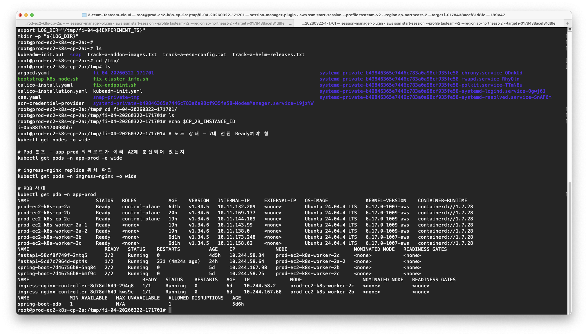
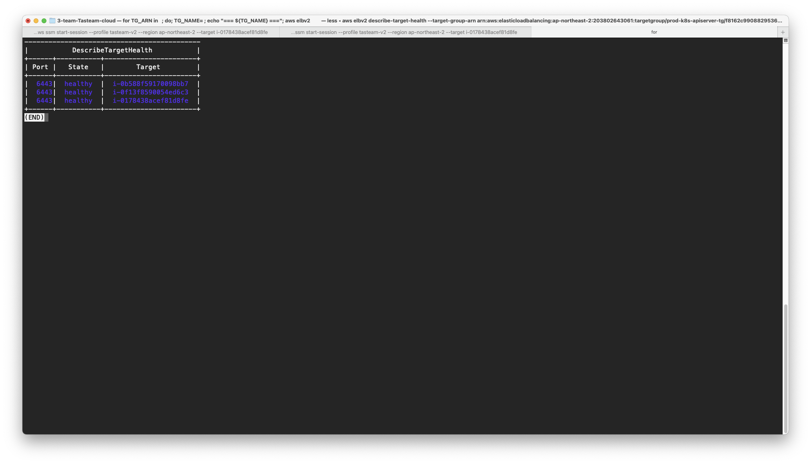
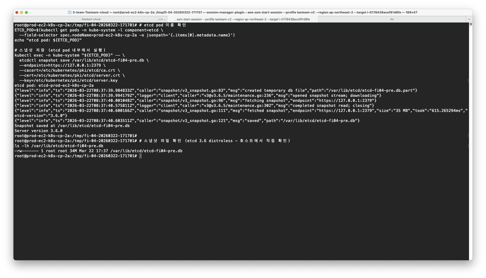
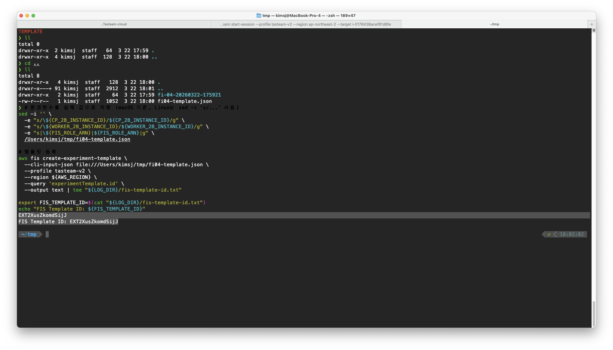
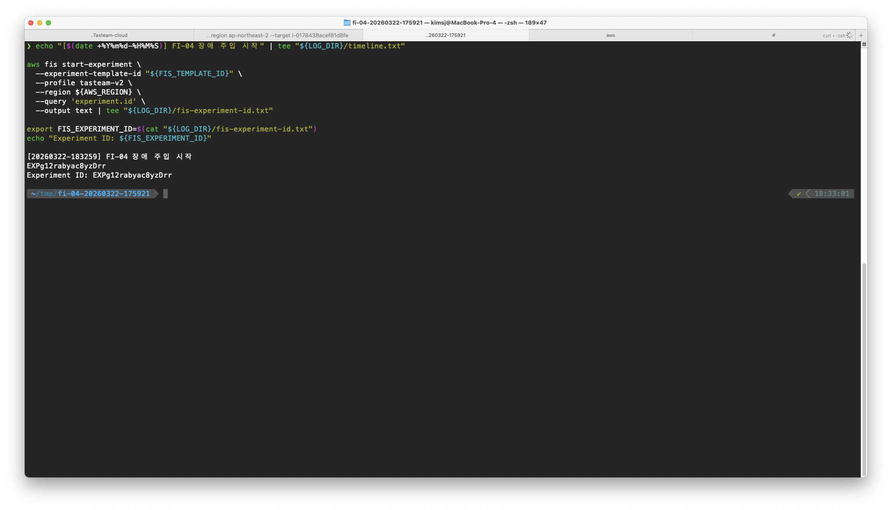
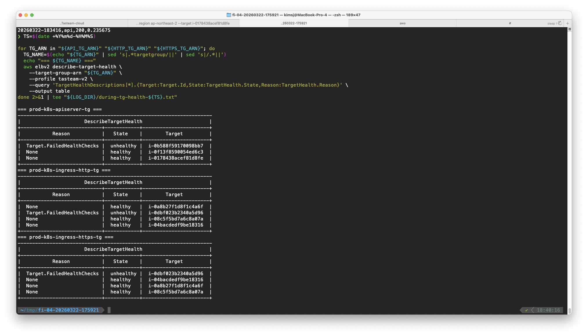

# FI-04. AZ 2b 장애 시뮬레이션 실험 보고서

> 실험일시: 2026-03-22 17:17 ~ 18:47 KST

---

## 1. 실험 개요

| 항목 | 내용 |
|---|---|
| 실험 ID | `EXPg12rabyac8yzDrr` |
| 템플릿 ID | `EXT2nFwnoTjLLzTr` |
| 실험 목적 | AZ 2b 전체 손실(cp-2b + worker-2b) 시에도 서비스가 유지되는지 검증 |
| 장애 주입 수단 | AWS FIS (`aws:ec2:stop-instances`) |
| 대상 인스턴스 | `i-0b588f59170098bb7` (cp-2b), `i-0dbf023b2340a5d96` (worker-2b) |
| 클러스터 구성 | cp 3대(2a/2b/2c) + worker 4대(2a-1/2a-2/2b/2c) |
| Stop Condition | CloudWatch Alarm — API TG unhealthy >= 3 시 자동 중단 |
| 관측 수단 | health check loop (1초 간격 curl), kubectl, NLB TG health |

### 가설

> AZ 2b가 손실되어도 etcd quorum(2/3)이 유지되고, 남은 worker 3대로 서비스가 지속되며, NLB가 unhealthy target을 자동 회피한다.

---

## 2. Pre-flight

### 2-1. 클러스터 상태 확인

7노드 전원 Ready, Pod 분포가 AZ 분산되어 있는 상태를 확인했다.

- cp-2a, cp-2b, cp-2c: Ready (control-plane)
- worker-2a-1, worker-2a-2, worker-2b, worker-2c: Ready
- spring-boot 4 replica, fastapi 2 replica 모두 Running
- ingress-nginx-controller Running
- PDB `spring-boot-pdb` 설정 확인



### 2-2. NLB Target Group Health 기준치

3개 TG 모두 전원 healthy 상태를 Before 증적으로 기록했다.

| Target Group | 타겟 수 | 상태 | 포트 |
|---|---|---|---|
| prod-k8s-apiserver-tg | 3/3 healthy | cp 3대 | 6443 |
| prod-k8s-ingress-http-tg | 4/4 healthy | worker 4대 | 30080 |
| prod-k8s-ingress-https-tg | 4/4 healthy | worker 4대 | 30443 |



### 2-3. etcd 스냅샷 백업

실험 전 etcd 스냅샷을 `/var/lib/etcd/etcd-fi04-pre.db` (34MB)로 저장했다. etcd 3.6 (distroless 이미지) 환경에서 `kubectl exec`을 통해 pod 내부에서 실행.



---

## 3. FIS 실험 준비

### 3-1. IAM Role + Stop Condition + 템플릿

| 리소스 | 내용 |
|---|---|
| IAM Role | `prod-fis-experiment-role` — EC2 stop/start 최소 권한 |
| CloudWatch Alarm | `fi04-stop-apiserver-tg-unhealthy` — unhealthy >= 3 시 FIS 자동 중단 |
| FIS 템플릿 | cp-2b + worker-2b 동시 stop (`EXT2nFwnoTjLLzTr`) |

초기 `logConfiguration` 포함 시 FIS Role 권한 오류(`logs:CreateLogDelivery`)가 발생하여, 로깅 설정을 제거한 버전으로 재등록했다.



---

## 4. 장애 주입 및 관측

### 4-1. FIS 실험 시작 (18:32:59)

FIS 실험 시작, cp-2b + worker-2b 동시 stop. 10초 내 `completed` 확인, stop condition 미발동.



### 4-2. 노드 NotReady 전환 + etcd quorum 확인

cp-2b, worker-2b가 `NotReady`로 전환. 나머지 5노드 `Ready` 유지. etcd 2/3 quorum 유지, kubectl 전 명령 정상 응답.

```
NAME                       STATUS     ROLES           AGE    VERSION
prod-ec2-k8s-cp-2a         Ready      control-plane   6d3h   v1.34.5
prod-ec2-k8s-cp-2b         NotReady   control-plane   21h    v1.34.6
prod-ec2-k8s-cp-2c         Ready      control-plane   21h    v1.34.6
prod-ec2-k8s-worker-2a-1   Ready      <none>          20h    v1.34.6
prod-ec2-k8s-worker-2a-2   Ready      <none>          20h    v1.34.6
prod-ec2-k8s-worker-2b     NotReady   <none>          6d2h   v1.34.5
prod-ec2-k8s-worker-2c     Ready      <none>          6d2h   v1.34.5
```

```
https://127.0.0.1:2379 is healthy: successfully committed proposal: took = 11.264555ms
```

### 4-3. NLB Target Group Health 변화

| Target Group | unhealthy 타겟 | healthy 타겟 |
|---|---|---|
| prod-k8s-apiserver-tg | `i-0b588f59` (cp-2b) — 1개 | 2개 |
| prod-k8s-ingress-http-tg | `i-0dbf023b` (worker-2b) — 1개 | 3개 |
| prod-k8s-ingress-https-tg | `i-0dbf023b` (worker-2b) — 1개 | 3개 |

NLB가 unhealthy target을 자동 회피하여 나머지 healthy target으로만 라우팅.



### 4-4. Pod 재스케줄

worker-2b에 있던 `spring-boot-5nq84`이 `Terminating` 상태로 전환되고, 새 Pod `spring-boot-xkj7x`가 worker-2a-1에서 자동 생성되어 Running.

```
spring-boot-7d46756b8-5nq84   2/2     Terminating   0     5d1h   prod-ec2-k8s-worker-2b
spring-boot-7d46756b8-xkj7x   2/2     Running       0     4m5s   prod-ec2-k8s-worker-2a-1
```

- spring-boot: 4/4 Running 유지 (PDB minAvailable=1 보장)
- fastapi: 2 replica 중 worker-2c의 Pod가 Running 유지

---

## 5. Health Check 가용성 분석

### 5-1. 전체 통계

| 항목 | 값 |
|---|---|
| 총 요청 수 | 885 |
| 성공 (HTTP 200) | 881 |
| 실패 (HTTP 000, timeout) | 4 |
| **가용성** | **99.55%** |

### 5-2. 장애 구간 상세

| 시각 | HTTP 코드 | 응답 시간(s) | 비고 |
|---|---|---|---|
| 18:33:21 | 000 | 10.002 | 첫 실패 (T+22초) |
| 18:33:32 | 000 | 10.006 | NLB unhealthy 감지 전 |
| 18:33:43 | 000 | 10.008 | NLB unhealthy 감지 전 |
| 18:33:54 | 000 | 10.002 | 마지막 실패 |
| 18:34:05 | 200 | 7.509 | 복구 시작 (NLB 라우팅 전환) |
| 18:34:14 | 200 | 0.305 | 완전 복구 |

### 5-3. 타임라인

```
18:32:59  FIS 실험 시작 (T+0)
18:33:21  첫 번째 실패 응답 (T+22초)
18:33:28  FIS status: completed
18:33:54  마지막 실패 응답 (T+55초)
18:34:05  서비스 복구 시작 (T+66초)
18:34:14  완전 복구 — 정상 응답시간 (T+75초)
18:40:14  NLB TG health 확인 (cp-2b, worker-2b unhealthy)
18:43:16  Pod 재스케줄 완료 확인
```

**서비스 중단 시간**: 약 **44초** (18:33:21 ~ 18:34:05)

---

## 6. Before / After 비교표

| 관측 항목 | Before | During (장애 중) | After (복구 후) |
|---|---|---|---|
| Ready 노드 수 | 7/7 | 5/7 | 5/7 (EC2 미복구 시) |
| API TG healthy | 3/3 | 2/3 | 2/3 |
| Ingress TG healthy | 4/4 | 3/4 | 3/4 |
| spring-boot Running | 4/4 | 4/4 (재스케줄 완료) | 4/4 |
| fastapi Running | 2/2 | 2/2 | 2/2 |
| Health check 가용성 | 100% | 99.55% | 100% |
| etcd member | 3 started | 2 started + 1 unreachable | 2 started + 1 unreachable |

---

## 7. 판정

| 항목 | 기준 | 결과 | 판정 |
|---|---|---|---|
| etcd quorum | kubectl 정상 응답 유지 | etcd 2/3 quorum 유지, kubectl 전 명령 정상 | **Pass** |
| API endpoint | API TG unhealthy 1개만 | cp-2b 1개만 unhealthy | **Pass** |
| 서비스 가용성 | 5xx < 1%, 복구 < 60초 | 실패 0.45% (4/885), 복구 44초 | **Pass** |
| Pod 재스케줄 | 5분 내 전체 Running | ~4분 내 재스케줄 완료 | **Pass** |
| 자동 복귀 | 수동 개입 없이 서비스 지속 | NLB 자동 회피, Pod 자동 재스케줄 | **Pass** |

### 최종 판정: Pass

---

## 8. 아키텍처 근거 서술

### 1) etcd quorum 2/3 유지

cp 3대를 각 AZ에 1대씩 분산 배치하여 AZ 1개 손실 시에도 etcd 과반수(2/3)를 확보.
실험 결과: cp-2b stop 후에도 kubectl, HPA 조회, rollout status 모두 정상 동작 확인.

### 2) NLB health check 파라미터

API TG의 health check를 interval 10s + unhealthy threshold 2로 설정하여 최대 20초 내 unhealthy 전환.
실험 결과: 장애 주입 후 약 22초 만에 첫 실패 발생, NLB가 unhealthy target 회피 시작. 총 44초 후 완전 복구.

### 3) PDB minAvailable

spring-boot에 PDB를 설정하여 장애 시에도 최소 replica를 보장.
실험 결과: worker-2b 손실 시에도 나머지 노드의 replica가 Running 유지, 재스케줄 완료 후 4/4 복원.

### 4) Worker N+1 설계

worker 4대 중 2a에 2대를 배치하여 AZ 2b 손실 시 남은 3대(2a-1, 2a-2, 2c)로 전체 워크로드 수용 가능.
실험 결과: 재스케줄 완료 후 모든 Pod Running, Pending 없음.

### 5) AWS FIS를 통한 카오스 엔지니어링

단순 `ec2 stop`이 아닌 AWS FIS를 활용하여 실험 ID, CloudWatch stop condition 체계를 갖춤.
프로덕션에서 안전하게 반복 가능한 장애 훈련 워크플로를 구축.

---

## 9. 이슈 및 교훈

| 이슈 | 원인 | 해결 |
|---|---|---|
| FIS Role `logs:CreateLogDelivery` 권한 부족 | FIS logConfiguration에 필요한 CloudWatch Logs 권한 미포함 | logConfiguration 제거 후 재등록 |
| SSM 노드에서 `aws elbv2` 권한 부족 | `prod-k8s-node-role`에 ELB 읽기 권한 미포함 | 로컬에서 `--profile tasteam-v2`로 실행 |
| etcd `snapshot status` 미지원 | etcd 3.6에서 해당 서브커맨드 제거됨 | 호스트에서 `ls -lh`로 파일 확인 |
| etcd 컨테이너 `ls` 미지원 | distroless 이미지에 shell/coreutils 없음 | 호스트 파일시스템에서 직접 확인 |

---

## 첨부 파일

| 파일 | 내용 |
|---|---|
| [timeline.txt](file/timeline.txt) | 실험 타임라인 |
| [health-loop.csv](file/health-loop.csv) | 1초 간격 health check 기록 (885행) |
| [baseline-tg-20260322-180327.json](file/baseline-tg-20260322-180327.json) | Before TG health 스냅샷 |
| [during-tg-health-20260322-184014.txt](file/during-tg-health-20260322-184014.txt) | During TG health 스냅샷 |
| [fis-template-id.txt](file/fis-template-id.txt) | FIS 템플릿 ID |
| [fis-experiment-id.txt](file/fis-experiment-id.txt) | FIS 실험 ID |
